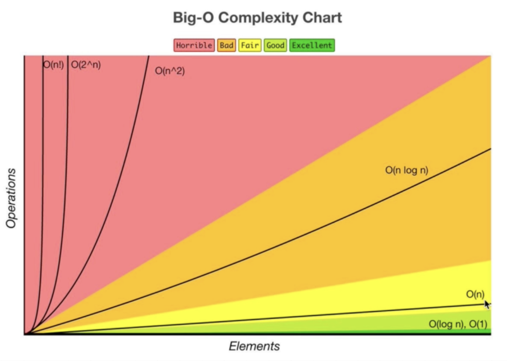

# DSA - Big O intro

let’s say we have 2 people,

A: Hey, my code runs in 3sec

B: hey, mine runs in 1.5 sec

Does B win? Not necessarily

Since it depends on several other factors such as what other CPU processes running, how powerful the CPU/computer is, what programming language you are using and If our code is on the server it would run on different systems, so how do we measure the performance of our code.

Big O → language we use for comparing how long the algorithm takes to run, regardless of the computer where it runs and determine what's the good/bad code and what's the code that can scale up.

- when we grow bigger with the input how much does the algorithm gets slower, the less it slows down the better it is.
- So instead of using `performance.now()` we can just calculate how many operations the computer has to perform.
- Big O doesnt measure the performance in time instead it measure the input Vs no. of operations the algorithm takes in runtime.

## What is the Big O for finding nemo?

Here as the no. of input elements increases, then the no. of operations increases as well → linear operation

## Big O Graph:



### O(n) → Linear time

    → As the no. of input elements increases, then the no. of operations increases as well.
    → eg: findingNemo function

### O(1) → Constant time

    → No matter how big the input grows, no of operations remains same
    → eg: compressFirstBox function

**BigO Exercise 1) What is the Big O of the below function? (Hint, you may want to go line by line)**

```
function funChallenge(input) {
	let a = 10;
	a = 50 + 3;
	for (let i = 0; i < input.length; i++) {
		anotherFunction();
		let stranger = true;
		a++;
	}
	return a;
}
```


<details>
<summary>Solution for Ex 1</summary>

```
function funChallenge(input) {
let a = 10; // O(1)
a = 50 + 3; // O(1)
for (let i = 0; i < input.length; i++) { // O(n)
anotherFunction(); // O(n)
let stranger = true; // O(n)
a++; // O(n)
}
return a; // O(1)
}
```
Ans: Big O( 3*O(1) + 4*O(n) ) = Big O(3 + 4n) ⇒ This simplifies to Big O(n)
</details>

**BigO Exercise 2) What is the Big O of the below function? (Hint, you may want to go line by line)**

```function anotherFunChallenge(input) .
  let a = 5;
  let b = 10;
  let c = 50;
  for (let i = 0; i < input; i++) {
    let x = i + 1;
    let y = i + 2;
    let z = i + 3;

  }
  for (let j = 0; j < input; j++) {
    let p = j * 2;
    let q = j * 2;
  }
  let whoAmI = "I don't know";
}
```

<details>
<summary>Solution for Ex 1</summary>
```
function anotherFunChallenge(input) {
let a = 5; // O(1)
let b = 10; // O(1)
let c = 50; // O(1)
for (let i = 0; i < input; i++) { // O(n)
let x = i + 1; // O(n)
let y = i + 2; // O(n)
let z = i + 3; // O(n)
}
for (let j = 0; j < input; j++) { // O(n)
let p = j _ 2; // O(n)
let q = j _ 2; // O(n)
}
let whoAmI = "I don't know"; // O(1)
}

= 4*O(1) + 4*O(n) + 3*O(n)
= 4 + 4n + 3n
= Big O(4 +7n) ⇒ This simplifies to Big O(n)
```
Ans: Big O( 3*O(1) + 4\*O(n) ) = Big O(3 + 4n) ⇒ This simplifies to Big O(n)

</details>
